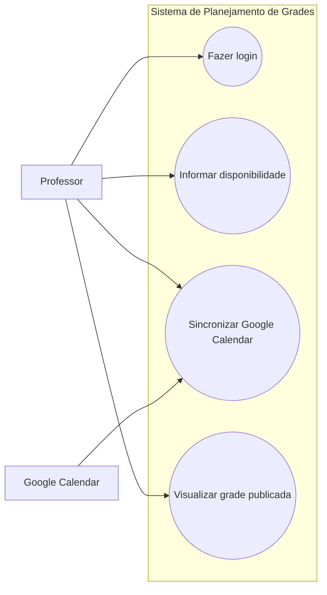
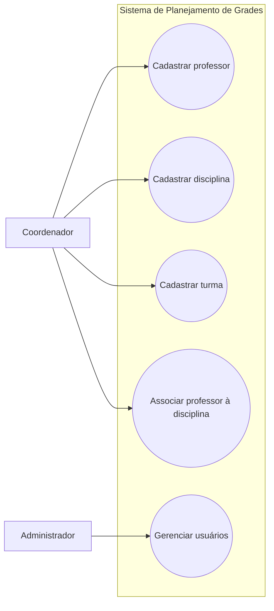
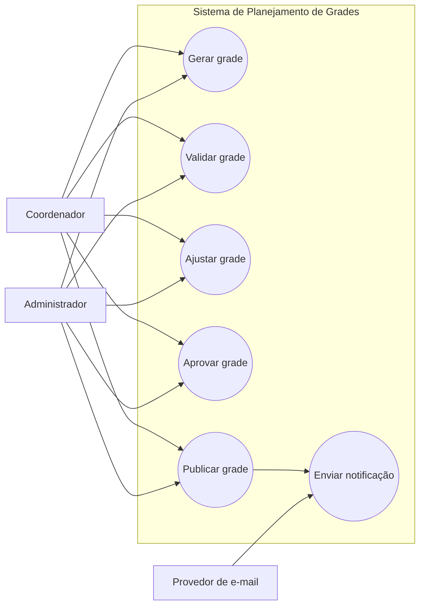

# Casos de uso principais

Este documento descreve as principais interações entre os atores e o sistema
de geração de grades de horários.

## Atores

| Ator | Responsabilidade |
| --- | --- |
| **Professor** | Sincronizar restrições de agenda e consultar a grade publicada. |
| **Coordenador/Administrador** | Gerenciar dados acadêmicos, gerar, ajustar, aprovar e publicar a grade. |
| **Google Calendar** | Fornecer eventos que representam indisponibilidades do professor. |
| **Provedor de e-mail** | Entregar as notificações de publicação da grade. |

## UC01 — Realizar login no sistema

- **Ator principal:** Coordenador/Administrador ou Professor
- **Objetivo:** Permitir acesso seguro à plataforma conforme o perfil do usuário.
- **Pré-condição:** O usuário possui uma conta no provedor externo aprovado.
- **Fluxo principal:**
  1. O usuário acessa a plataforma.
  2. O sistema redireciona o usuário para o provedor externo.
  3. O provedor valida as credenciais e retorna a identidade autenticada.
  4. O sistema identifica o perfil do usuário.
  5. O sistema libera o painel correspondente.
- **Exceções:** Em caso de falha ou cancelamento da autenticação, o acesso é
  negado e o evento pode ser registrado para auditoria.

## UC02 — Sincronizar restrições de horário

- **Ator principal:** Professor
- **Objetivo:** Importar da agenda externa os horários em que o professor não
  está disponível.
- **Pré-condição:** O professor está autenticado e concedeu permissão de
  leitura da agenda.
- **Fluxo principal:**
  1. O professor acessa o painel de disponibilidade.
  2. O professor autoriza a leitura do Google Calendar.
  3. O sistema consulta os eventos do período selecionado.
  4. O sistema converte os eventos em restrições de disponibilidade.
  5. O sistema salva ou atualiza as restrições no banco de dados.
- **Exceções:** O sistema informa ao professor quando a autorização expirar,
  a API estiver indisponível ou não houver eventos no período consultado.

## UC03 — Gerenciar estrutura curricular

- **Ator principal:** Coordenador/Administrador
- **Objetivo:** Manter os dados necessários para a geração da grade.
- **Fluxo principal:** O coordenador cadastra, consulta, altera ou remove
  professores, disciplinas, turmas e cargas horárias, além de associar cada
  professor às disciplinas que está apto a lecionar.
- **Regra:** Operações de alteração e exclusão devem respeitar as permissões
  do perfil e gerar auditoria quando forem críticas.

## UC04 — Gerar e validar grade de horários

- **Ator principal:** Coordenador/Administrador
- **Objetivo:** Criar uma proposta de grade sem violar cargas horárias,
  indisponibilidades ou conflitos de professores.
- **Pré-condição:** Os dados curriculares e as restrições de disponibilidade
  estão cadastrados.
- **Fluxo principal:**
  1. O coordenador seleciona o semestre ou período.
  2. O sistema valida os dados de entrada.
  3. O backend executa o algoritmo de alocação.
  4. O sistema apresenta a proposta e eventuais conflitos não resolvidos.
  5. O coordenador ajusta manualmente os horários, se necessário.
  6. O sistema salva a versão como rascunho ou pronta para aprovação.

## UC05 — Publicar grade e notificar professores

- **Ator principal:** Coordenador/Administrador
- **Objetivo:** Tornar oficial a grade validada e comunicar os professores.
- **Pré-condição:** A grade foi revisada e não possui conflitos impeditivos.
- **Fluxo principal:**
  1. O coordenador solicita a aprovação da grade.
  2. O sistema registra a operação no log de auditoria.
  3. O sistema altera o status da grade para **Aprovada/Publicada**.
  4. O sistema envia um e-mail ou notificação para os professores afetados.
  5. Os professores acessam o link para consultar seus horários.
- **Exceções:** Falhas de envio devem ser registradas e disponibilizadas para
  reprocessamento, sem desfazer a aprovação da grade.

## Estados sugeridos da grade

`Rascunho` → `Em validação` → `Aprovada` → `Publicada`

Uma grade publicada não deve ser alterada silenciosamente. Correções devem
gerar uma nova versão ou registrar explicitamente a alteração no histórico.

## Diagramas

### 1. Autenticação e funções do professor

### 2. Gestão acadêmica

### 3. Geração e publicação da grade

    
