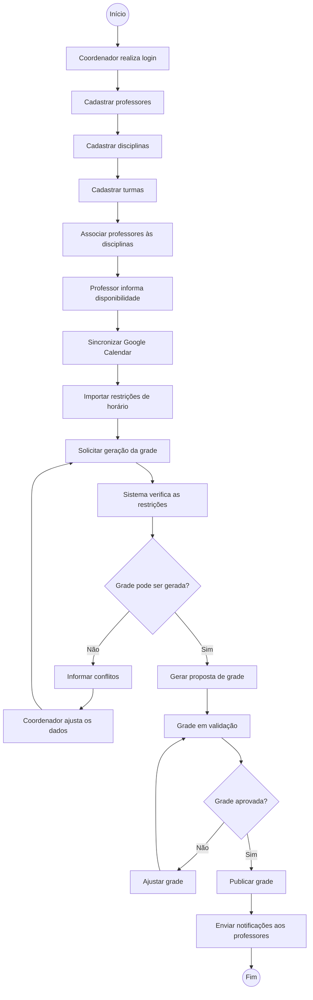

## Diagrama de atividade
Fluxo principal do sistema, desde o cadastro até a publicação da grade.

```mermaid
flowchart TD

    Inicio((Início))

    A["Coordenador realiza login"]
    B["Cadastrar professores"]
    C["Cadastrar disciplinas"]
    D["Cadastrar turmas"]
    E["Associar professores às disciplinas"]

    F["Professor informa disponibilidade"]
    G["Sincronizar Google Calendar"]
    H["Importar restrições de horário"]

    I["Solicitar geração da grade"]
    J["Sistema verifica as restrições"]

    K{"Grade pode ser gerada?"}

    L["Gerar proposta de grade"]
    M["Informar conflitos"]
    N["Coordenador ajusta os dados"]

    O["Grade em validação"]
    P{"Grade aprovada?"}

    Q["Ajustar grade"]
    R["Publicar grade"]
    S["Enviar notificações aos professores"]

    Fim((Fim))

    Inicio --> A
    A --> B
    B --> C
    C --> D
    D --> E

    E --> F
    F --> G
    G --> H
    H --> I

    I --> J
    J --> K

    K -- "Não" --> M
    M --> N
    N --> I

    K -- "Sim" --> L
    L --> O
    O --> P

    P -- "Não" --> Q
    Q --> O

    P -- "Sim" --> R
    R --> S
    S --> Fim
```
