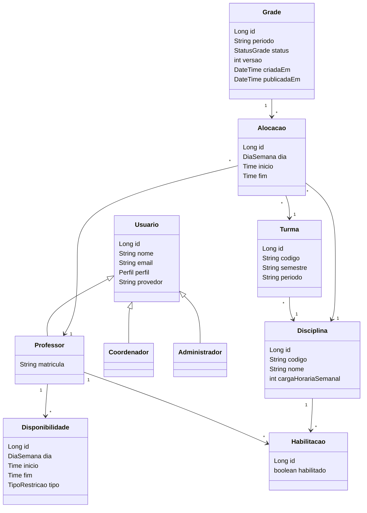
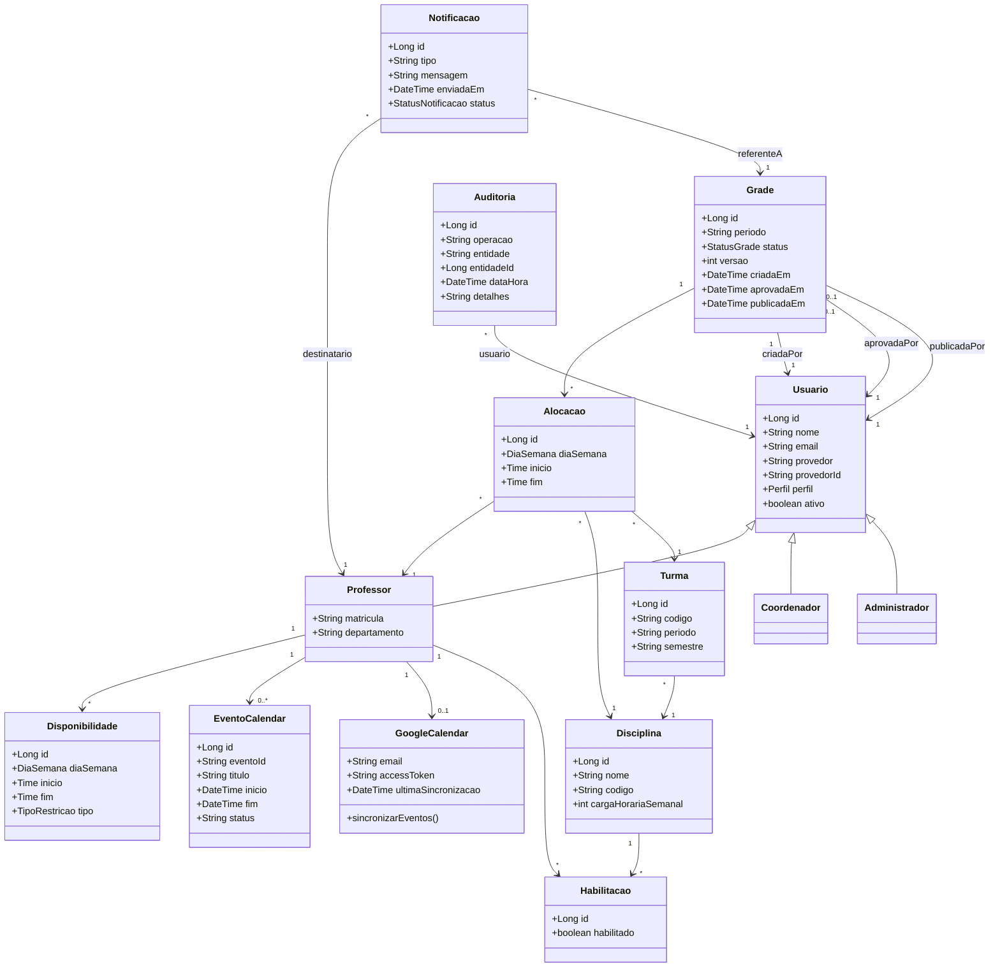

## Diagrama de Classe resumido

```mermaid
classDiagram
    class Usuario {
        Long id
        String nome
        String email
        Perfil perfil
        String provedor
    }

    class Professor {
        String matricula
    }

    class Coordenador

    class Administrador

    class Disciplina {
        Long id
        String codigo
        String nome
        int cargaHorariaSemanal
    }

    class Turma {
        Long id
        String codigo
        String semestre
        String periodo
    }

    class Habilitacao {
        Long id
        boolean habilitado
    }

    class Disponibilidade {
        Long id
        DiaSemana dia
        Time inicio
        Time fim
        TipoRestricao tipo
    }

    class Grade {
        Long id
        String periodo
        StatusGrade status
        int versao
        DateTime criadaEm
        DateTime publicadaEm
    }

    class Alocacao {
        Long id
        DiaSemana dia
        Time inicio
        Time fim
    }

    Usuario <|-- Professor
    Usuario <|-- Coordenador
    Usuario <|-- Administrador

    Professor "1" --> "*" Disponibilidade
    Professor "1" --> "*" Habilitacao
    Disciplina "1" --> "*" Habilitacao

    Turma "*" --> "1" Disciplina

    Grade "1" --> "*" Alocacao

    Alocacao "*" --> "1" Professor
    Alocacao "*" --> "1" Disciplina
    Alocacao "*" --> "1" Turma
```
## Diagrama de Classe completo 

```mermaid
classDiagram

    class Usuario {
        +Long id
        +String nome
        +String email
        +String provedor
        +String provedorId
        +Perfil perfil
        +boolean ativo
    }

    class Professor {
        +String matricula
        +String departamento
    }

    class Coordenador {
    }

    class Administrador {
    }

    class Disciplina {
        +Long id
        +String nome
        +String codigo
        +int cargaHorariaSemanal
    }

    class Turma {
        +Long id
        +String codigo
        +String periodo
        +String semestre
    }

    class Habilitacao {
        +Long id
        +boolean habilitado
    }

    class Disponibilidade {
        +Long id
        +DiaSemana diaSemana
        +Time inicio
        +Time fim
        +TipoRestricao tipo
    }

    class EventoCalendar {
        +Long id
        +String eventoId
        +String titulo
        +DateTime inicio
        +DateTime fim
        +String status
    }

    class Grade {
        +Long id
        +String periodo
        +StatusGrade status
        +int versao
        +DateTime criadaEm
        +DateTime aprovadaEm
        +DateTime publicadaEm
    }

    class Alocacao {
        +Long id
        +DiaSemana diaSemana
        +Time inicio
        +Time fim
    }

    class Auditoria {
        +Long id
        +String operacao
        +String entidade
        +Long entidadeId
        +DateTime dataHora
        +String detalhes
    }

    class Notificacao {
        +Long id
        +String tipo
        +String mensagem
        +DateTime enviadaEm
        +StatusNotificacao status
    }

    class GoogleCalendar {
        +String email
        +String accessToken
        +DateTime ultimaSincronizacao
        +sincronizarEventos()
    }

    Usuario <|-- Professor
    Usuario <|-- Coordenador
    Usuario <|-- Administrador

    Professor "1" --> "*" Disponibilidade
    Professor "1" --> "0..*" EventoCalendar
    Professor "1" --> "0..1" GoogleCalendar

    Professor "1" --> "*" Habilitacao
    Disciplina "1" --> "*" Habilitacao

    Turma "*" --> "1" Disciplina

    Grade "1" --> "*" Alocacao
    Alocacao "*" --> "1" Professor
    Alocacao "*" --> "1" Disciplina
    Alocacao "*" --> "1" Turma

    Grade "1" --> "1" Usuario : criadaPor
    Grade "0..1" --> "1" Usuario : aprovadaPor
    Grade "0..1" --> "1" Usuario : publicadaPor

    Auditoria "*" --> "1" Usuario : usuario

    Notificacao "*" --> "1" Professor : destinatario
    Notificacao "*" --> "1" Grade : referenteA
```
