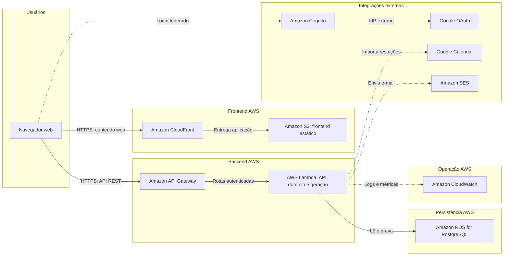
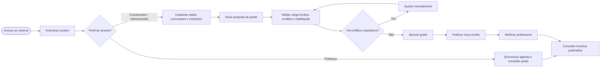
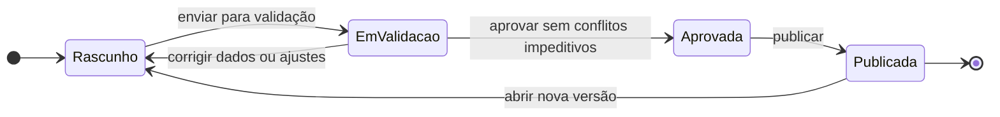

# Diagramas de blocos

Os diagramas abaixo representam uma proposta de arquitetura AWS para o
Classly. A proposta mantém o escopo documentado: aplicação web
cliente-servidor, backend em nuvem, persistência dos dados e integrações com
autenticação, Google Calendar e provedor de e-mail.

## 1. Arquitetura AWS em blocos — MVP econômico

### Serviços AWS representados

| Bloco | Serviço | Responsabilidade |
| --- | --- | --- |
| Frontend | Amazon S3 + CloudFront | Hospedar e entregar a aplicação web estática. |
| Entrada | Amazon API Gateway | Expor a API HTTPS para o frontend. |
| Autenticação | Amazon Cognito + Google OAuth | Autenticar usuários e fornecer tokens para a API. |
| Computação | AWS Lambda | Executar API, domínio, geração, validação e notificações em uma função inicial. |
| Banco | Amazon RDS for PostgreSQL | Persistir usuários, estrutura curricular, grades, alocações e auditoria. |
| E-mail | Amazon SES | Enviar a comunicação de publicação da grade. |
| Observabilidade | Amazon CloudWatch | Centralizar logs, métricas e falhas operacionais. |

## 2. Fluxo principal de geração e publicação

## 3. Ciclo de vida da grade

