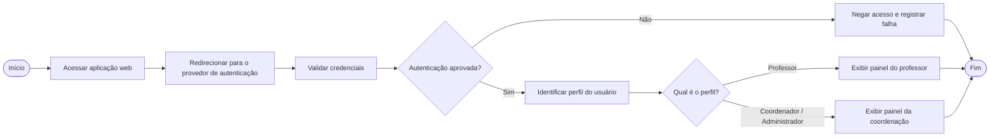
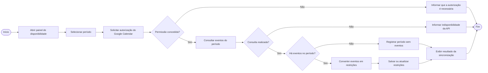
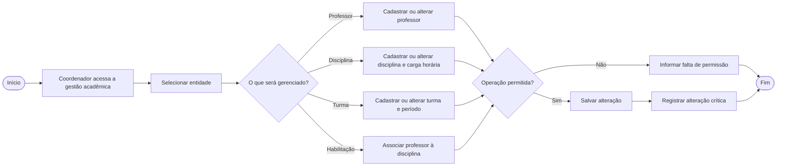

# Fluxogramas do sistema

Os fluxogramas detalham os principais processos do Classly conforme os casos
de uso e as regras de negócio documentados.

## 1. Fluxograma de autenticação

## 2. Fluxograma de sincronização do Google Calendar

## 3. Fluxograma de geração, validação e publicação

```mermaid
flowchart LR
    inicio(["Início"])
    selecionar["Selecionar semestre ou período"]
    conferirDados["Conferir dados curriculares e restrições"]
    dadosValidos{"Dados suficientes?"}
    corrigirDados["Corrigir professores, disciplinas, turmas ou restrições"]
    gerar["Gerar proposta de grade"]
    validar["Validar carga horária, habilitação e conflitos"]
    conflito{"Há conflito impeditivo?"}
    exibirConflitos["Exibir conflitos não resolvidos"]
    ajustar["Ajustar horários manualmente"]
    salvarRascunho["Salvar versão como rascunho"]
    aprovar["Aprovar grade"]
    auditar["Registrar aprovação e publicação na auditoria"]
    publicar["Publicar grade aprovada"]
    notificar["Enviar notificação aos professores"]
    consultar["Disponibilizar consulta da grade"]
    fim(["Fim"])

    inicio --> selecionar
    selecionar --> conferirDados
    conferirDados --> dadosValidos
    dadosValidos -->|"Não"| corrigirDados
    corrigirDados --> conferirDados
    dadosValidos -->|"Sim"| gerar
    gerar --> validar
    validar --> conflito
    conflito -->|"Sim"| exibirConflitos
    exibirConflitos --> ajustar
    ajustar --> validar
    conflito -->|"Não"| salvarRascunho
    salvarRascunho --> aprovar
    aprovar --> auditar
    auditar --> publicar
    publicar --> notificar
    notificar --> consultar
    consultar --> fim
```

## 4. Fluxograma de gestão da estrutura curricular

